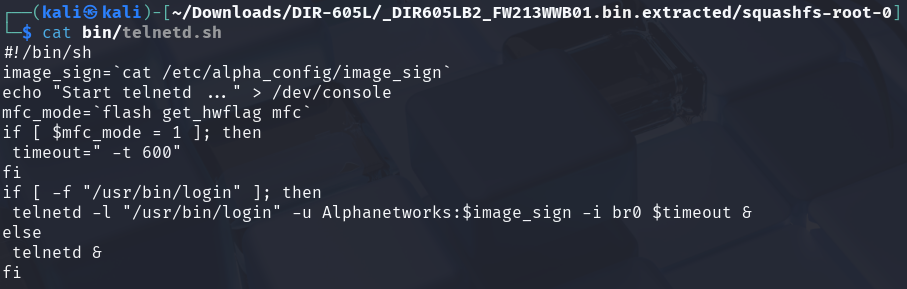
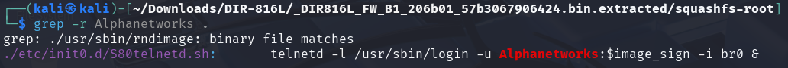
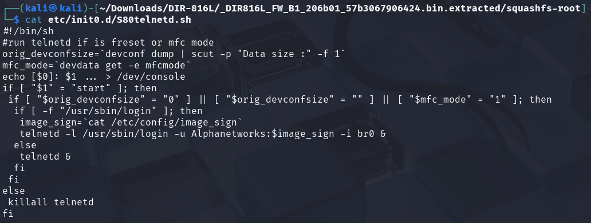

# CVE-2025-46176

## Description

Hardcoded credentials in the Telnet service in D-Link DIR-605L v2.13B01 and DIR-816L v2.06B01 allow attackers to remotely execute arbitrary commands via firmware analysis.

## Firmware

Version:
- D-Link DIR-605L: [v2.13B01](https://support.dlink.com/resource/SECURITY_ADVISEMENTS/DIR-605L/REVB/DIR-605L_REVB_FIRMWARE_v2.13B01_BETA.zip)
- D-Link DIR-816L: [v2.06B01](https://dlinkmea.com/upload/downloadable/DIR816L_FW_B1_206b01_57b3067906424.bin)

## Analysis of the DIR-605L firmware

The firmware has been extracted using [binwalk](https://github.com/ReFirmLabs/binwalk), which revealed a SquashFS file system.

Grepping for "Alphanetworks" in the file systems led us to the telnetd initialization script `./bin/telnetd.sh`.

The telnetd service is initialize with the user "Alphanetworks" with the password set to `$image_sign`. `$image_sign` was read from `./etc/alpha_config/image_sign`. This file contains the password for the "Alphanetworks" user.

Reading the image sign file gives us the hardcoded password.

## Analysis of the DIR-816L firmware

The firmware has been extracted using [binwalk](https://github.com/ReFirmLabs/binwalk), which revealed a SquashFS file system.

Grepping for "Alphanetworks" in the file systems led us to the telnetd initialization script `./bin/telnetd.sh`.

The telnetd service is initialize with the user "Alphanetworks" with the password set to `$image_sign`. `$image_sign` was read from `./etc/alpha_config/image_sign`. This file contains the password for the "Alphanetworks" user.

Reading the image sign file gives us the hardcoded password.

## Disclosure

[D-Link's Announcement](https://supportannouncement.us.dlink.com/security/publication.aspx?name=SAP10427)
