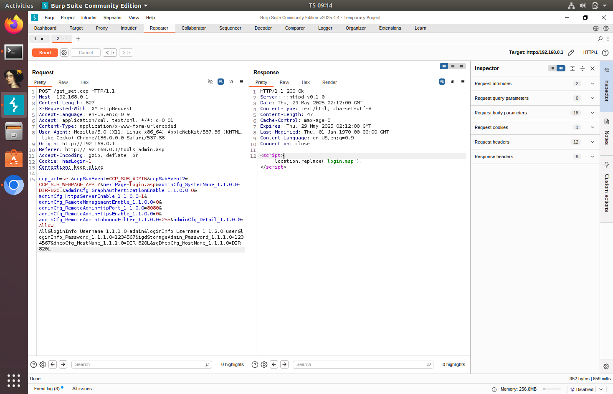
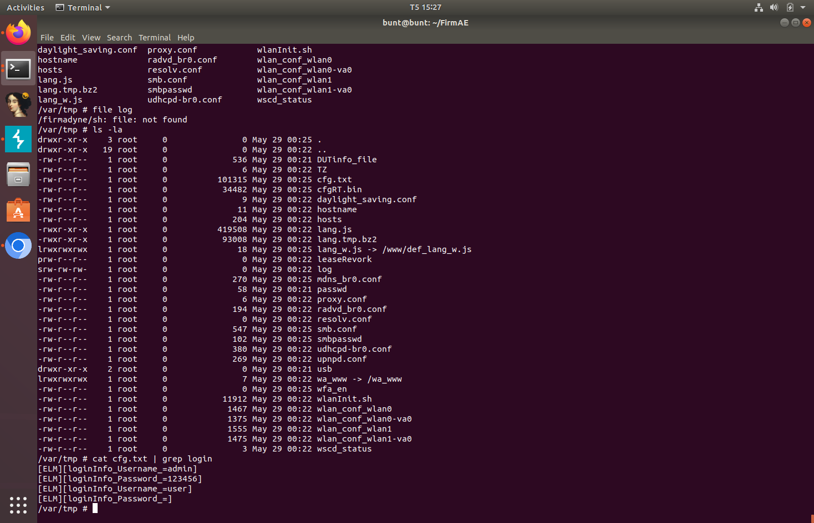
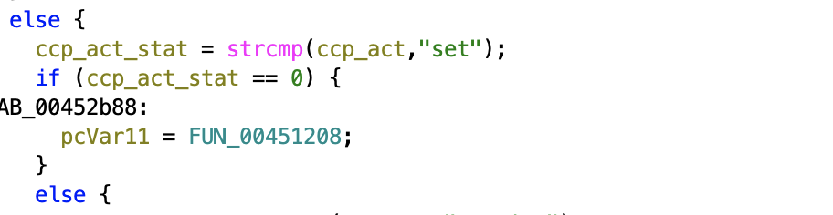
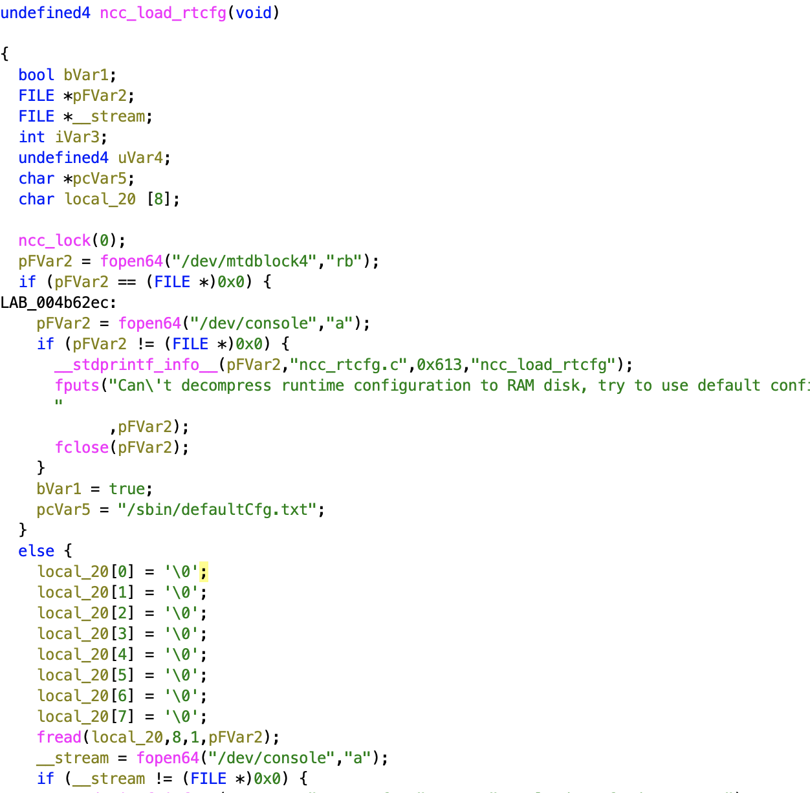

# CVE-2025-52079

## Description

The administrator password setting of the D-Link DIR-820L 1.06B02 is has Improper Access Control and is vulnerable to Unverified Password Change via crafted POST request to `/get_set.ccp`

## Firmware

- D-Link DIR-820L: [1.06B02](https://legacyfiles.us.dlink.com/DIR-820L/REVA/FIRMWARE/DIR-820L_REVA_FIRMWARE_1.06B02.ZIP)

## Vulnerability

The `ncc2` service in the router does not implement any user identity verification before accepting a configuration change request. This allows an attacker to send a request to the `/get_set.ccp` endpoint without need to be logged in, enabling the attacker to change the admin password. The below image shows a successful request that changes the password of the admin account without needing to log into the admin account or enter the admin password beforehand.

If we check the configuration file in the device (`/var/tmp/cfg.txt`), we can see that the password change is successful.

And using the password that we set with the 'admin' username, we can access the admin account of the router.

## Extra details

The `ncc2` service contains the function `FUN_00451208`, which is responsible for handling configuration modification request.

`/sbin/defaultCfg.txt` contains the default configuration that will be read into the device on boot. The configuration device during runtime is `/var/tmp/cfg.txt`, which contains the configuration of the `/sbin/defaultCfg.txt` on boot. Any configuration modification request the user makes will modify this `/var/tmp/cfg.txt` file. The `ncc_load_rtcfg` functions illustrates this functionality.

Within the firmware of the device, there's no implementation of user identity verification before allowing the user to change device configurations.
